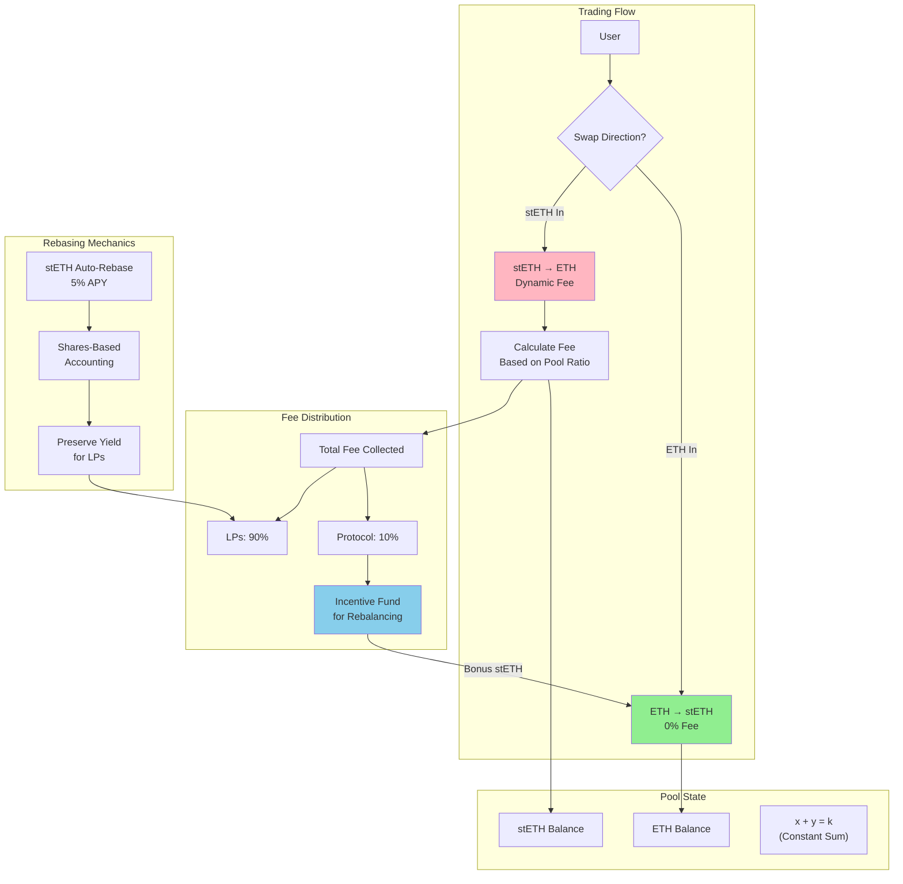
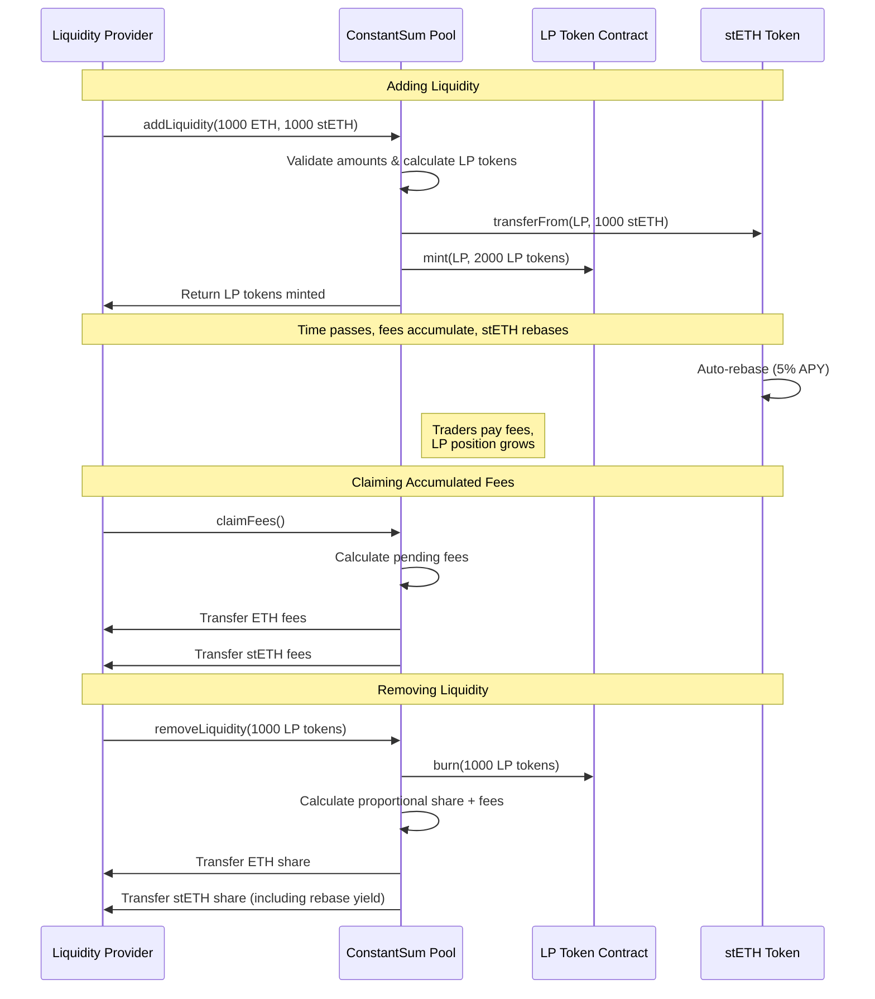
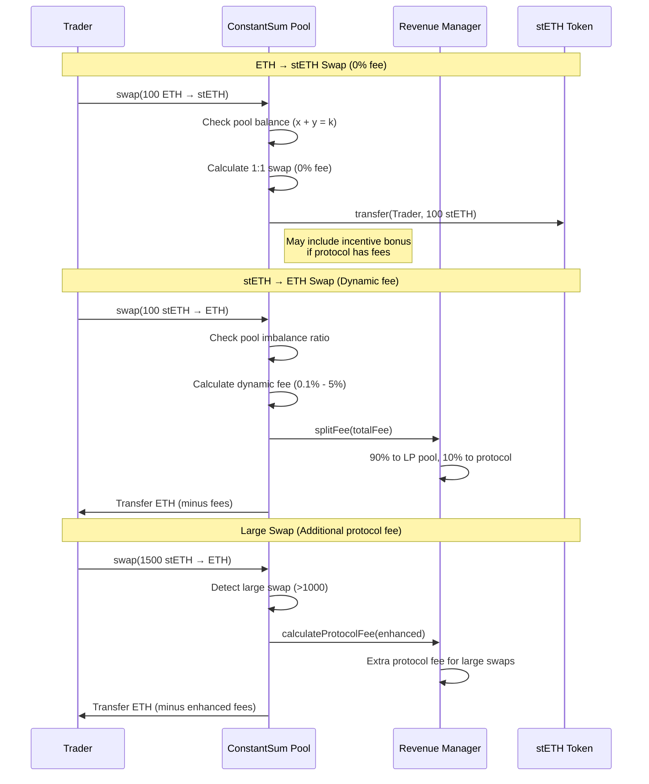

# Uniswap v4 Constant Sum Pool with Dynamic Fees

## How It Works



## User Flows

### Liquidity Provider Journey



### Trader Journey



## What I Built

I created a new type of AMM that works completely differently from traditional pools. Instead of the usual x\*y=k curve that causes slippage, I use x+y=k which enables perfect 1:1 swaps when the pool is balanced.

The magic happens with my dynamic fee system - I charge zero fees for ETH→stETH swaps (encouraging staking) but apply increasing fees for stETH→ETH swaps as the pool gets imbalanced. This naturally keeps the pool stable while generating revenue that funds incentives to bring it back into balance.

The pool also properly handles rebasing tokens like stETH, so liquidity providers don't lose their staking yield just because they're providing liquidity.

## How It's Built

The core innovation is using `x + y = k` instead of the traditional `x * y = k` formula. This means when the pool is balanced, you can swap 100 ETH for exactly 100 stETH with zero slippage - something impossible with regular AMMs.

I implemented this as a Uniswap v4 hook that intercepts swaps and applies my custom logic. The fee structure is intentionally asymmetric:

- ETH → stETH: Always 0% (I want to encourage staking)
- stETH → ETH: Dynamic fees that increase as the pool gets unbalanced

### Dynamic Fee Tiers

The fees automatically adjust based on how much ETH is left in the pool:

- Pool has 70-80% ETH: 0.1% fee (balanced, low fee)
- Pool has 60-70% ETH: 0.5% fee (slightly unbalanced)
- Pool has 50-60% ETH: 1.0% fee (getting concerning)
- Pool has 40-50% ETH: 2.0% fee (significantly unbalanced)
- Pool has <40% ETH: 5.0% fee (emergency mode)

This creates natural economic pressure to keep the pool balanced - as ETH gets scarce, it becomes more expensive to withdraw, which encourages people to deposit more ETH instead.

### Rebasing Token Support

One of the trickiest parts was handling stETH properly. Regular AMMs break when you add rebasing tokens because the balances change over time. I solved this with a shares-based accounting system that preserves the underlying yield.

My test stETH implementation gives 5% APY, and crucially, LPs don't lose this yield when they provide liquidity. The rebasing happens continuously based on time elapsed.

### LP Token System

I built a proper ERC20 LP token that represents your share of the pool. When you add liquidity, you get LP tokens. When you remove liquidity, you burn your LP tokens and get back your proportional share of the pool PLUS any fees that accumulated while you were providing liquidity.

The cool part is that fees automatically compound - instead of needing to manually claim them, they just increase the value of your LP position over time.

### Revenue Sharing

Here's where it gets interesting economically. When fees are collected, they're split:

- 90% goes to liquidity providers (you earn fees for providing liquidity)
- 10% goes to the protocol

But here's the clever bit - those protocol fees don't just sit there. They fund incentives for ETH→stETH swaps. So when the pool gets unbalanced (too much stETH, not enough ETH), we can use the accumulated protocol fees to give people a small bonus for depositing ETH.

### The Self-Balancing Loop

This creates a beautiful self-balancing system:

1. Pool gets unbalanced (too much stETH)
2. stETH→ETH swaps become more expensive (higher fees)
3. Higher fees generate more protocol revenue
4. Protocol revenue funds incentives for ETH deposits
5. People deposit ETH to get the bonus
6. Pool rebalances naturally

The system is completely sustainable because it only spends what it earns.

- **Self-Balancing**: Incentives funded by fees collected from the opposite direction
- **Rate Limiting**: Incentives capped at 0.1% and only when sufficient protocol fees exist
- **Sustainability**: System only spends what it earns, ensuring long-term viability

## Technical Features

### Smart Contract Components

1. **Main Pool Contract** (`Counter.sol`): Core AMM logic and Uniswap v4 hook integration
2. **LP Token** (`ConstantSumLP.sol`): ERC20 token for liquidity provider shares
3. **Revenue Manager** (`RevenueManager.sol`): Fee calculation and distribution
4. **Rebasing Token** (`StETH.sol`): Mock stETH with 5% APY for testing

### Key Functions

- `addLiquidity()`: Add liquidity and receive LP tokens
- `removeLiquidity()`: Burn LP tokens and withdraw assets + accumulated fees
- `beforeSwap()`: Uniswap v4 hook that implements constant-sum swaps with dynamic fees
- `claimFees()`: Allow LPs to claim accumulated fees
- `rebase()`: Update stETH balances based on time-based yield

### Testing Suite

- **74 Tests Total** covering all functionality
- **Unit Tests**: Individual contract functionality
- **Rebasing Tests**: Time-based yield mechanics
- **Fee Distribution Tests**: Multi-LP scenarios

## Why This Design Is Better

### No More Slippage Hell

You know how frustrating it is when you try to swap a decent amount on Uniswap and lose 2-3% to slippage? That doesn't happen here. When our pool is balanced, you can swap 10,000 ETH for exactly 10,000 stETH. Zero slippage, zero price impact.

Traditional AMMs spread your liquidity across a curve where most of it sits unused. I put ALL the liquidity right at the current price where trades actually happen.

### Actually Profitable for LPs

Regular AMMs are pretty bad for liquidity providers - you suffer impermanent loss, earn fees only on the tiny fraction of your liquidity that's actually being used, and if you're providing liquidity for rebasing tokens like stETH, you often lose the underlying yield.

I fixed all of that:

- No impermanent loss risk (ETH and stETH move together)
- You earn fees on your entire position, not just a sliver
- You keep your stETH staking yield while providing liquidity
- Fees automatically compound into your position

### The Pool Maintains Itself

This might be the coolest part - the pool naturally stays balanced without any external intervention. When it gets unbalanced, economic forces automatically kick in to bring it back to equilibrium:

- Higher fees discourage the trades causing imbalance
- Those fees fund incentives for trades that restore balance
- No one needs to manually adjust anything

### Perfect for Institutional Trading

Institutions need predictable execution for large trades. My 1:1 swaps with zero slippage make this the most capital-efficient way to trade between ETH and stETH. Plus, the math is simple enough that institutions can easily integrate this into their existing systems.

### Actually Sustainable

Unlike most DeFi protocols that promise the moon and then slowly die as token incentives run out, my system is genuinely sustainable. I only spend what I earn, and the incentive mechanisms actually get stronger as volume increases.

## Use Cases

### Primary Use Case: ETH/stETH Trading

- **Stakers**: Easy entry/exit from Ethereum staking without slippage
- **Institutions**: Large ETH/stETH swaps without price impact
- **Arbitrageurs**: Profit from price discrepancies between platforms
- **LPs**: Earn fees while maintaining staking yield

### Secondary Applications

- **Any 1:1 Correlated Pairs**: USDC/USDT, wstETH/stETH, etc.
- **Stable Asset Trading**: Assets that should trade at par
- **Wrapped Token Pairs**: ETH/WETH, BTC/WBTC, etc.

## Development & Testing

### Local Development Setup

```bash
# Start local development environment
make dev

# Run tests
make test

# Stop environment
make stop
```

### Test Coverage

- **Unit Tests**: 24 tests for individual contracts
- **Integration Tests**: 50 tests for cross-contract functionality
- **All Tests Pass**: 74/74 tests passing with comprehensive coverage

### Deployment

- **Local Anvil**: Arbitrum mainnet fork for realistic testing
- **Real Infrastructure**: Uses actual Uniswap v4 PoolManager
- **Bootstrap Ready**: Automatically provides initial liquidity for testing

## What Makes This Special

I'm pretty sure this is the first constant-sum AMM built on Uniswap v4, and definitely the first AMM that properly handles rebasing tokens without destroying the underlying yield.

The dynamic fee system is also something new - most AMMs just have fixed fees that don't respond to market conditions. My fees actually get smarter based on what's happening in the pool.

But the real innovation is how all the pieces work together. The fees fund the incentives, the incentives balance the pool, the balancing reduces the fees - it's a self-sustaining economic loop that gets more stable over time rather than less.

I think this could be a template for how to build AMMs for any pair of correlated assets, not just ETH/stETH. The constant-sum invariant just makes so much more sense when you know the assets should trade near 1:1.
