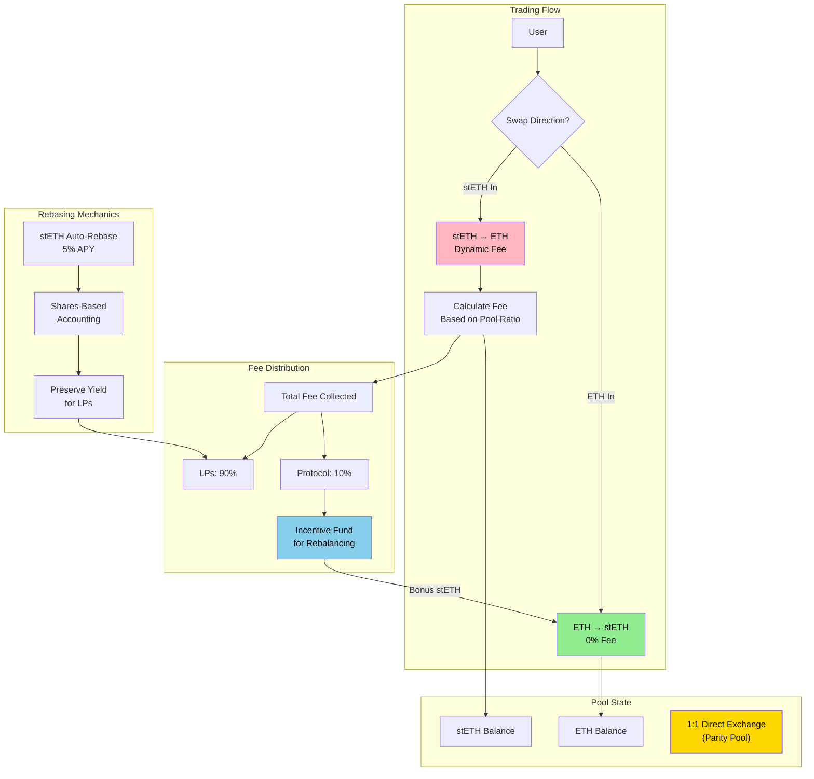
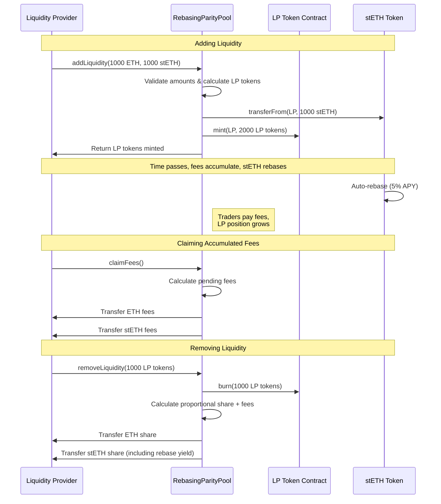

# stETHer: Parity Pool for ETH/stETH Trading

🏆 **3rd Place Winner - Uniswap Foundation Prize at [EthGlobal NYC 2025](https://ethglobal.com/showcase/stether-b0moi "Go to EthGlobal showcase page")**

A custom parity pool that enables direct `1:1 ETH/stETH` swaps with zero slippage, dynamic asymmetric fees, and sustainable incentives.

## Deployed Contracts (Unichain Mainnet)

- StETH: `0x51aE19065794D01886f97A93E7DC5967940f2894`
- ProtocolRevenue: `0x581E767fFF7136f57D33109BfB6121a01c7bc868`
- RebasingParityPool: `0x522C190f46256270177F9aC6AF296319f157c888`
- ParityLP: `0x8D5E57cf10877E42654d6a084b0511F4E94d0e5B`
- PoolManager: `0x1F98400000000000000000000000000000000004`

## How It Works

## User Flows

### Liquidity Provider Journey

### Trader Journey

## Implementation

The system implements direct 1:1 token exchanges through a Uniswap v4 hook. ETH→stETH swaps incur 0% fees. stETH→ETH swaps apply dynamic fees ranging from 0.1% to 5% based on pool imbalance ratios.

Rebasing token accounting uses a shares-based mechanism to preserve underlying yield for liquidity providers. The stETH implementation provides 500 basis points (5%) annual yield.

## Architecture

The system operates as a Uniswap v4 hook that intercepts swap operations and applies custom exchange logic. Swaps execute at a 1:1 ratio with the following fee structure:

- ETH → stETH: 0% fee
- stETH → ETH: Dynamic fees based on pool imbalance

### Fee Schedule

Dynamic fees apply to stETH → ETH swaps based on pool balance ratios:

- Ratio ≤ 1.1:1: 0.1% (1,000 basis points)
- Ratio 1.1-1.2:1: 0.2% (2,000 basis points)
- Ratio 1.2-1.5:1: 0.5% (5,000 basis points)
- Ratio 1.5-2:1: 2.0% (20,000 basis points)
- Ratio > 2:1: 5.0% (50,000 basis points)

### Rebasing Mechanism

The implementation handles rebasing tokens through shares-based accounting. The stETH contract generates yield at 500 basis points annually through time-based rebasing calculations.

### LP Token System

The `ParityLP` ERC20 contract represents liquidity provider shares. LP tokens are minted upon liquidity deposits and burned upon withdrawals. Accumulated fees compound automatically into LP token value.

### Revenue Distribution

The `ProtocolRevenue` contract manages fee allocation:

- 90% distributed to liquidity providers
- 10% allocated to protocol treasury
- Additional 0.05% protocol fee applied to swaps exceeding 1,000 tokens
- Protocol fees fund incentive mechanisms for ETH→stETH swaps

### Incentive Mechanism

The system implements automatic rebalancing through economic incentives:

1. Pool imbalance increases stETH→ETH swap fees
2. Increased fees generate protocol revenue
3. Protocol revenue funds incentives for ETH→stETH swaps
4. Incentives encourage deposits that rebalance the pool

Incentive rates are capped at 0.1% and activated only when sufficient protocol fees are available. The mechanism operates within collected revenue constraints.

## Technical Features

### Smart Contract Components

1. **Main Pool Contract** (`RebasingParityPool.sol`): Core pool logic and Uniswap v4 hook integration
2. **LP Token** (`ParityLP.sol`): ERC20 token for liquidity provider shares
3. **Protocol Revenue** (`ProtocolRevenue.sol`): Fee collection and protocol treasury management
4. **Rebasing Token** (`StETH.sol`): Mock stETH with 5% APY for testing

### Key Functions

- `addLiquidity()`: Add liquidity and receive LP tokens
- `removeLiquidity()`: Burn LP tokens and withdraw assets + accumulated fees
- `beforeSwap()`: Uniswap v4 hook that implements parity swaps with dynamic fees
- `claimFees()`: Allow LPs to claim accumulated fees
- `rebase()`: Update stETH balances based on time-based yield
