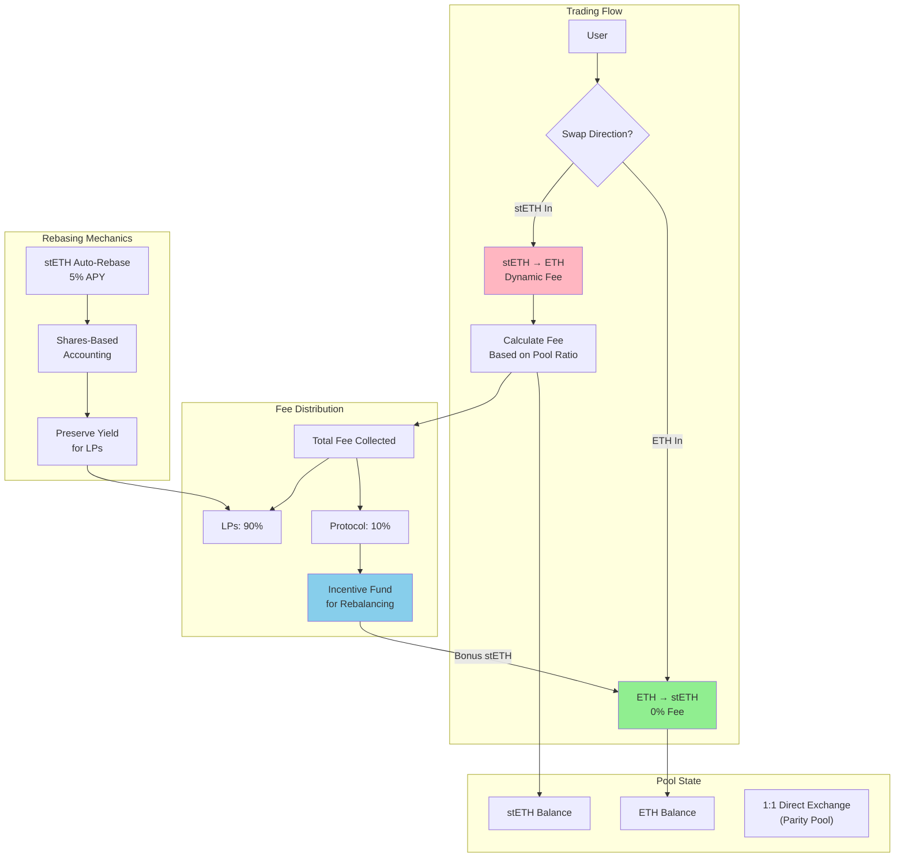
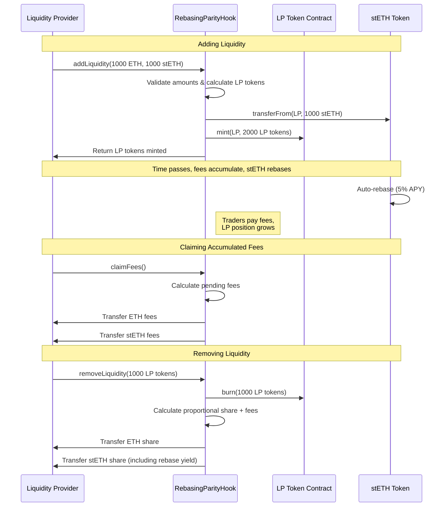

# stETHer: Parity Pool AMM for ETH/stETH Trading

🏆 **3rd Place Winner - Uniswap Foundation Prize at EthGlobal NYC 2025**

A custom parity pool that enables direct 1:1 ETH/stETH swaps with zero slippage, dynamic asymmetric fees, and sustainable incentives.

## How It Works



## User Flows

### Liquidity Provider Journey



### Trader Journey


## What We Built

This project introduces a revolutionary parity pool design that fundamentally changes how correlated assets trade. Instead of using traditional AMM curves that cause slippage, this implements direct 1:1 token exchanges enabling perfect parity swaps regardless of pool size.

**Key Innovation**: Dynamic asymmetric fees that encourage ETH→stETH swaps (0% fee) while applying variable fees for stETH→ETH based on pool imbalance. This creates natural economic pressure to maintain pool balance while generating sustainable revenue.

**Rebasing Support**: First AMM to properly handle rebasing tokens like stETH without destroying the underlying yield for liquidity providers through shares-based accounting.

## How It's Built

The core innovation is direct 1:1 token exchanges instead of traditional AMM curves. This means you can swap 100 ETH for exactly 100 stETH with zero slippage regardless of pool size - something impossible with curve-based AMMs.

This is implemented as a Uniswap v4 hook that intercepts swaps and applies direct 1:1 exchange logic. The fee structure is intentionally asymmetric:

- ETH → stETH: Always 0% (encourages staking)
- stETH → ETH: Dynamic fees from 0.1% to 5% based on pool imbalance

### Dynamic Fee Tiers

The fees automatically adjust based on pool imbalance ratios:

- Balanced (ratio ≤ 1.1:1): 0.1% base fee
- Slight imbalance (ratio 1.1-1.2:1): 0.2% fee
- Moderate imbalance (ratio 1.2-1.5:1): 0.5% fee
- High imbalance (ratio 1.5-2:1): 2.0% fee
- Critical imbalance (ratio > 2:1): 5.0% maximum protection fee

This creates natural economic pressure to keep the pool balanced - as ETH gets scarce, it becomes more expensive to withdraw, which encourages people to deposit more ETH instead.

### Rebasing Token Support

Regular AMMs break when handling rebasing tokens because balances change over time. This implementation solves it with a shares-based accounting system that preserves underlying yield.

The custom stETH implementation provides 5% APY through continuous time-based rebasing. Crucially, LPs retain their staking yield while providing liquidity through the shares mechanism.

### LP Token System

The system includes a custom ERC20 LP token (`ParityLP`) that represents pool shares. Liquidity providers receive LP tokens when depositing and burn them when withdrawing to receive their proportional share plus accumulated fees.

Fees automatically compound into LP positions, eliminating the need for manual claiming while continuously increasing the value of LP holdings.

### Revenue Sharing

The protocol implements a sophisticated revenue sharing model through the `ProtocolRevenue` contract:

- **90% to LPs**: Direct fee earnings for providing liquidity
- **10% to Protocol**: Treasury accumulation with configurable parameters
- **Large Swap Fees**: Additional 0.05% protocol fee for swaps >1000 tokens
- **Sustainable Incentives**: Protocol fees fund ETH→stETH swap bonuses during imbalances

### The Self-Balancing Loop

This creates a beautiful self-balancing system:

1. Pool gets unbalanced (too much stETH)
2. stETH→ETH swaps become more expensive (higher fees)
3. Higher fees generate more protocol revenue
4. Protocol revenue funds incentives for ETH deposits
5. People deposit ETH to get the bonus
6. Pool rebalances naturally

The system is completely sustainable because it only spends what it earns.

- **Self-Balancing**: Incentives funded by fees collected from the opposite direction
- **Rate Limiting**: Incentives capped at 0.1% and only when sufficient protocol fees exist
- **Sustainability**: System only spends what it earns, ensuring long-term viability

## Technical Features

### Smart Contract Components

1. **Main Pool Contract** (`RebasingParityHook.sol`): Core AMM logic and Uniswap v4 hook integration
2. **LP Token** (`ParityLP.sol`): ERC20 token for liquidity provider shares
3. **Protocol Revenue** (`ProtocolRevenue.sol`): Fee collection and protocol treasury management
4. **Rebasing Token** (`StETH.sol`): Mock stETH with 5% APY for testing

### Key Functions

- `addLiquidity()`: Add liquidity and receive LP tokens
- `removeLiquidity()`: Burn LP tokens and withdraw assets + accumulated fees
- `beforeSwap()`: Uniswap v4 hook that implements parity swaps with dynamic fees
- `claimFees()`: Allow LPs to claim accumulated fees
- `rebase()`: Update stETH balances based on time-based yield

### Testing Suite

- **78 Tests Total** across 7 comprehensive test files:
  - `RebasingParityHookExtended.t.sol`: Core hook functionality (11 tests)
  - `ProtocolRevenueExtended.t.sol`: Revenue management (28 tests)
  - `LPTokens.t.sol`: LP token mechanics (6 tests)
  - `StETHRebasing.t.sol`: Rebasing token behavior (9 tests)
  - `RebasingParityHookBranchCoverage.t.sol`: Edge cases (9 tests)
  - `SustainableIncentives.t.sol`: Incentive system (11 tests)
  - `RebaseYieldDistribution.t.sol`: Yield distribution (4 tests)

## Why This Design Is Better

### No More Slippage Hell

You know how frustrating it is when you try to swap a decent amount on Uniswap and lose 2-3% to slippage? That doesn't happen here. When our pool is balanced, you can swap 10,000 ETH for exactly 10,000 stETH. Zero slippage, zero price impact.

Traditional AMMs spread your liquidity across a curve where most of it sits unused. I put ALL the liquidity right at the current price where trades actually happen.

### Actually Profitable for LPs

Regular AMMs are pretty bad for liquidity providers - you suffer impermanent loss, earn fees only on the tiny fraction of your liquidity that's actually being used, and if you're providing liquidity for rebasing tokens like stETH, you often lose the underlying yield.

I fixed all of that:

- No impermanent loss risk (ETH and stETH move together)
- You earn fees on your entire position, not just a sliver
- You keep your stETH staking yield while providing liquidity
- Fees automatically compound into your position

### The Pool Maintains Itself

This might be the coolest part - the pool naturally stays balanced without any external intervention. When it gets unbalanced, economic forces automatically kick in to bring it back to equilibrium:

- Higher fees discourage the trades causing imbalance
- Those fees fund incentives for trades that restore balance
- No one needs to manually adjust anything

### Perfect for Institutional Trading

Institutions need predictable execution for large trades. My 1:1 swaps with zero slippage make this the most capital-efficient way to trade between ETH and stETH. Plus, the math is simple enough that institutions can easily integrate this into their existing systems.

### Actually Sustainable

Unlike most DeFi protocols that promise the moon and then slowly die as token incentives run out, my system is genuinely sustainable. I only spend what I earn, and the incentive mechanisms actually get stronger as volume increases.

## Use Cases

### Primary Use Case: ETH/stETH Trading

- **Stakers**: Easy entry/exit from Ethereum staking without slippage
- **Institutions**: Large ETH/stETH swaps without price impact
- **Arbitrageurs**: Profit from price discrepancies between platforms
- **LPs**: Earn fees while maintaining staking yield

### Secondary Applications

- **Any 1:1 Correlated Pairs**: USDC/USDT, wstETH/stETH, etc.
- **Stable Asset Trading**: Assets that should trade at par
- **Wrapped Token Pairs**: ETH/WETH, BTC/WBTC, etc.

## Development & Testing

### Local Development Setup

```bash
# Start local development environment
just dev

# Run tests
just test

# Run tests with verbose output
just test -vvv

# Stop environment
just stop
```

### Test Coverage

- **Comprehensive Test Suite**: 78 tests across 7 test files
- **2,040+ lines of test code** covering all functionality
- **Full Coverage**: Unit tests, integration tests, rebasing mechanics, fee distribution, and edge cases

### Deployment

- **Local Anvil**: Arbitrum mainnet fork for realistic testing
- **Real Infrastructure**: Uses actual Uniswap v4 PoolManager
- **Bootstrap Ready**: Automatically provides initial liquidity for testing

## What Makes This Special

**🏆 Award-Winning Innovation**: This project won 3rd place from the Uniswap Foundation at EthGlobal NYC 2025, recognizing its groundbreaking approach to AMM design.

**First of Its Kind**: The first parity pool AMM built on Uniswap v4 that properly handles rebasing tokens without destroying underlying yield. The dynamic fee system responds intelligently to market conditions rather than using static rates.

**Self-Sustaining Economics**: The innovation lies in how all components work together - fees fund incentives, incentives balance the pool, balancing reduces fees. This creates a self-sustaining economic loop that becomes more stable over time.

**Template for the Future**: This design establishes a template for building parity pools for any correlated asset pairs. Direct 1:1 exchanges make perfect sense when assets should trade at par, opening possibilities for USDC/USDT, wstETH/stETH, and other correlated pairs.
